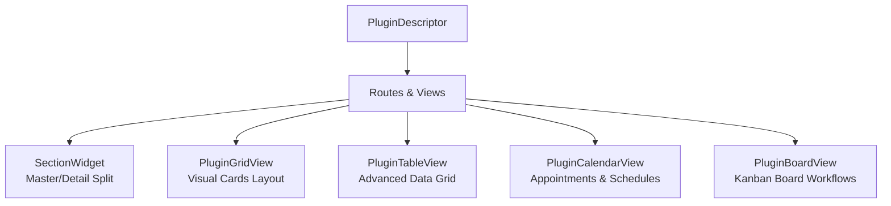

# Web UI Plugins — UI Expansion & Architecture Roadmap

Currently, the `web_ui_plugin` package has a solid foundation for managing CRUD operations through two primary UI building blocks:
1. **`SectionWidget`**: A responsive, two-pane Master/Detail split layout (`CustomListView` and detailed pane).
2. **`FormPageView`**: A declarative, form-driven editor with validation and dynamic field types (Text, Dropdown, Multi-select, Date, Time, Age).

To evolve this into a **truly professional, plug-and-play B2B SaaS web framework** (for clinical management, salons, and medical admins), we need to expand beyond forms. This document serves as your technical guide and architectural roadmap.

---

## 1. Existing Dart & Flutter Packages for Web Plugins

If you want to use existing packages as adapters or dependencies instead of building everything from scratch, the Dart/Flutter ecosystem has several powerful options:

### 1.1 Micro-Frontend & Architecture Packages
*   **`flutter_micro_app`**: If you want to decouple separate features completely. It provides an event-driven system, dynamic modular navigation, and deep linking across modules.
*   **`melos`**: Essential for monorepos. If your plugins live in separate packages (e.g., `/packages/clinic_billing`, `/packages/clinic_emr`), Melos simplifies package-to-package dependencies, versioning, and unified testing.

### 1.2 Interactive Scheduling & Calendars (Critical for Bookings)
*   **`syncfusion_flutter_calendar`**: The gold standard for business calendars on the web. It has day, week, work week, month, and timeline views. Supports drag-and-drop, custom styling, and performs extremely well on Flutter Web. *(Commercial license required for enterprises, but free community tier available).*
*   **`table_calendar`**: Lightweight, beautiful, and highly customizable. Excellent for simple month/week date-pickers and agenda views, though it lacks a full day/hour grid like Outlook or Google Calendar.

### 1.3 Advanced Data Tables
*   **`pluto_grid`**: A powerhouse for web admin panels. It supports Excel-like inline editing, column freezing, global/column filtering, pagination, drag-and-drop columns, and multi-selection out of the box. Highly recommended for reporting and heavy data entry.
*   **`data_table_2`**: An excellent wrapper over Flutter's native `PaginatedDataTable` that fixes responsiveness, offers easy column sizing, sticky headers, and custom styling.

### 1.4 Charts & Visual Analytics
*   **`fl_chart`**: The most popular and beautifully animatable charting package. It supports line, bar, pie, scatter, and radar charts. Fully customizable and responsive for dashboard KPI visualizations.
*   **`syncfusion_flutter_charts`**: High-performance, rich visualization charts including area, box-plot, funnel, and sparklines.

---

## 2. Dynamic UI Widgets to Implement Next

To make the plugins framework truly complete, you should introduce four new top-level **View Primitives** that map directly to common domain tasks:



### 2.1 The "Visual Card Grid" View (`PluginGridView`)
The current layout is a text-heavy vertical list. For modules like **"Pets"**, **"Inventory / Products"**, or **"Service Packages"**, a visual card grid is much more intuitive.

#### Key Features:
*   **Responsive Grid**: Auto-wrapping grid using `SliverGrid` with `SliverGridDelegateWithMaxCrossAxisExtent`.
*   **Rich Cards (`PluginCardWidget`)**: Support for images (via `UploadCapability`), visual badges (status, tags), title, subtitle, and action buttons.
*   **Hover states**: Elevate on hover, show contextual action overlays (Edit, Quick Actions, Status Toggle).

---

### 2.2 The "KPI Metrics" Widget (`KpiCardWidget`)
For the main **Dashboard** or individual module landing pages, operators need instant analytical feedback.

#### Design Recommendations:
*   **Harmonious Color Palettes**: Sleek HSL-tailored borders and faint gradients (no harsh solid colors).
*   **Trend Indicators**: Green/Red micro-badges showing percentage changes (`+12.4% this week`).
*   **Sparklines**: Miniature line charts (`fl_chart`) embedded inside the card to show historical performance.

---

### 3. Concrete Architectural Blueprints for Your Registry

Let's design how these new views fit into your existing declarative architecture. By modifying `PluginDescriptor` to support these views, developers can spin up entire dashboard pages or kanban pipelines in minutes.

### 3.1 KPI Metric Card declaration
Let's define a new standard primitive in `lib/src/core/widgets/kpi_card_widget.dart`:

```dart
class KpiCardConfig {
  final String key;
  final String title;
  final String Function(List<dynamic> items) computeValue;
  final IconData icon;
  final Color color;
  final String? trendSuffix;
  // Dynamic calculation for trend (e.g. comparing last month vs this month)
  final double Function(List<dynamic> items)? computeTrendPercent;

  const KpiCardConfig({
    required this.key,
    required this.title,
    required this.computeValue,
    required this.icon,
    required this.color,
    this.trendSuffix,
    this.computeTrendPercent,
  });
}
```

---

### 3.2 Advanced Data Table declaration (`PluginTableView`)
Instead of `SectionWidget`, a developer should be able to write an administrative list page as a spreadsheet-like data grid.

Here is how you can declare `PluginTableView` in the plugin route:

```dart
class PluginTableView<T extends DataModel> extends StatelessWidget {
  final List<TableColumnConfig<T>> columns;
  final SectionRepo<T> repo;
  final FormCubit<T> formCubit;
  final VoidCallback? onAddPressed;

  const PluginTableView({
    super.key,
    required this.columns,
    required this.repo,
    required this.formCubit,
    this.onAddPressed,
  });

  @override
  Widget build(BuildContext context) {
    // Renders a beautiful card container with:
    // 1. A unified Header (Title, customizable search bar, Export CSV button, Add FAB)
    // 2. A responsive Paginated Table with hover-highlighting rows
    // 3. Sorting logic automatically wired to SectionCubit
    return Container(); // Implementation details using DataTable2 or PlutoGrid
  }
}

class TableColumnConfig<T> {
  final String label;
  final Widget Function(T item) cellBuilder;
  final double? width;
  final bool isSortable;
  final Comparable Function(T item)? sortValue;

  const TableColumnConfig({
    required this.label,
    required this.cellBuilder,
    this.width,
    this.isSortable = true,
    this.sortValue,
  });
}
```

---

### 3.3 Dynamic Kanban Board View (`PluginBoardView`)
For workflow items like appointments (Scheduled $\rightarrow$ Checked In $\rightarrow$ In Consultation $\rightarrow$ Completed) or payments (Draft $\rightarrow$ Sent $\rightarrow$ Paid $\rightarrow$ Overdue), a horizontal kanban board is the best interface.

You can declare a board by mapping an `enum` representing the workflow phases:

```dart
class PluginBoardView<T extends DataModel, S extends Enum> extends StatelessWidget {
  final SectionRepo<T> repo;
  final FormCubit<T> formCubit;
  
  /// The field key in the DataModel that holds the status enum
  final String statusFieldKey;
  
  /// List of statuses to render as board columns
  final List<S> statuses;
  
  /// How to build the card item in the column
  final Widget Function(T item) cardBuilder;
  
  /// Callback when an item is dragged from one column to another
  final Future<void> Function(T item, S targetStatus)? onItemMoved;

  const PluginBoardView({
    super.key,
    required this.repo,
    required this.formCubit,
    required this.statusFieldKey,
    required this.statuses,
    required this.cardBuilder,
    this.onItemMoved,
  });

  @override
  Widget build(BuildContext context) {
    // Renders horizontal columns using SingleChildScrollView + Row
    // Each column is a DragTarget where items (wrapped in Draggable) can be dropped.
    // Coordination is handled reactively: dropping triggers 'onItemMoved' which
    // calls formCubit.updateItem() behind the scenes, instantly syncing Firestore!
    return Container();
  }
}
```

---

## 4. Summary: How to Expand Your Codebase Step-by-Step

To introduce these rich web capabilities into `web_ui_plugin`, follow this sequence:

### Phase 1: Metric Cards & Dashboard Support
1. Create `kpi_card_widget.dart` in `lib/src/core/widgets/`.
2. Add a `dashboard` view to your bootstrap or example navigation that aggregates data across multiple `SectionRepo`s to show stats like "Total Active Doctors", "Total Registered Clients", and "Pending Bookings".

### Phase 2: Advanced Data Grid
1. Integrate `data_table_2` or implement a clean responsive dynamic table in `lib/src/core/section/widget/plugin_table_view.dart`.
2. Support full-width row selections, double-click to view details, and an `Export to CSV` action in the table headers.

### Phase 4: Drag-and-Drop Kanban Board
1. Leverage Flutter's built-in `LongPressDraggable` (or simple `Draggable` on Web) and `DragTarget`.
2. Implement `PluginBoardView` so that changing an entity's state is as simple as dragging it across the screen, automatically invoking the underlying `FormCubit` and Firestore listeners to update state dynamically.


## 12. Known Issues & Improvement Backlog

Issues found during architecture review (April 2026). Ordered by severity.


### #1 — `DataModel.uid` typed `String?` but semantically required — MEDIUM
**File:** `lib/src/core/contracts/data_model.dart`
**Problem:** `String? get uid; // not null` — the comment contradicts the type. Every downstream lookup (`item.uid == id`) must null-check unnecessarily.
**Fix:** Change to `String get uid`. All concrete models must provide a non-null uid, surfacing missing IDs at compile time.

### #2 — `UploadCapability` stored in `BootstrapConfig` but never injected into plugins — MEDIUM
**File:** `lib/src/core/bootstrap/app_bootstrap.dart`
**Problem:** `BootstrapConfig.uploadCapability` is accepted but never passed to `FormCubit` or `PluginDescriptor`. Plugins that declare `supportsUpload: true` have no access to the capability at runtime.
**Fix:** Pass `uploadCapability` through `AppBootstrap._buildCubits` or expose it via a `RepositoryProvider<UploadCapability>`.

### #4 — `FormRepoMixin.update` and `FormCubit.updateItem` expose an index — MEDIUM
**Files:** `form_repo_mixin.dart`, `form_cubit.dart`
**Problem:** `update(int index, T item)` — callers must track a list position. The underlying service finds items by `id`, not index; the index only updates the local cache.
**Fix:** Change signature to `update(T item)` and find the cache index internally via `items.indexWhere((e) => e.uid == item.uid)`.

### #5 — `ScopedRepo` uses `(service as dynamic).collectionName` — MEDIUM
**File:** `lib/src/adapters/firebase/scoped_repo.dart`
**Problem:** Dynamic cast to read `collectionName` silently falls back to `T.toString()` if the cast fails, producing a wrong registry key.
**Fix:** Define `abstract interface CollectionNamed { String get collectionName; }`, implement it on `FirestoreService`, and cast to `CollectionNamed` instead of `dynamic`.


### #6 — No `onError` handler on realtime stream subscriptions — MEDIUM
**Files:** `section_cubit.dart`, `form_repo_mixin.dart`
**Problem:** `_repoStream.listen((data) { ... })` has no `onError` callback. A Firestore permission error or network failure silently cancels the subscription with no state update.
**Fix:** Add `onError: (error) => emit(state.copyWith(status: SuccessStatus.failure))` (and equivalent in `FormRepoMixin`).

### #7 — `SectionState.addedItemId` skips the sentinel pattern in `copyWith` — LOW
**File:** `lib/src/core/section/cubit/section_state.dart`
**Problem:** Every call to `copyWith(searchText: 'x')` silently resets `addedItemId` to `null` because it does not fall back to `this.addedItemId`.
**Fix:** Apply the same `static const Object _unset` sentinel pattern used by `selectedItem` and `fromDate`.
---